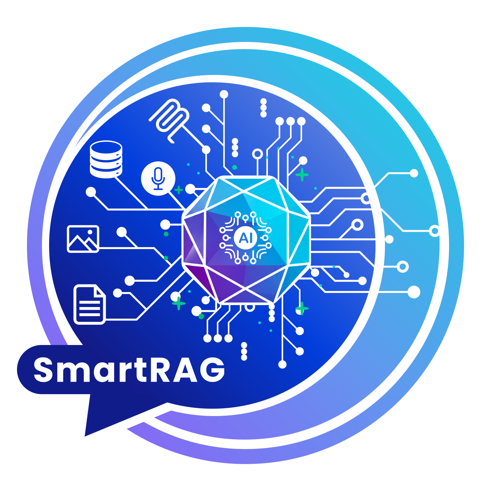

# SmartRAG Demo

<p align="center">
  
</p>

<p align="center">
  <b>SmartRAG için etkileşimli gösterim uygulaması</b>
</p>

<p align="center">
  <a href="../../README.tr.md"></a>
  <a href="README.md"></a>
  <a href="README-Docker.tr.md"></a>
</p>

---

### **Önkoşullar**
- **.NET 9.0 SDK** - Demo'yu çalıştırmak için gerekli
- **Docker Desktop** (opsiyonel) - Yerel servisler için (AI, veritabanları, vektör depoları)
- **VEYA Bulut AI API Anahtarları** (opsiyonel) - Bulut AI sağlayıcıları için

## 🐳 **Docker Kurulumu**

Detaylı Docker konfigürasyonu ve yönetimi için:

📖 **[Tam Docker Kurulum Rehberi](README-Docker.tr.md)**

## 🎯 **Test Edebilecekleriniz**

### **🔗 Veritabanı Yönetimi**
- **Adım 1-2**: Bağlantıları göster ve sistem sağlık kontrolü
- **Adım 3-5**: Test veritabanları oluştur (SQL Server, MySQL, PostgreSQL)
- **Adım 6**: SQLite test veritabanı oluştur
- **Adım 7**: Veritabanı şemalarını ve ilişkileri görüntüle

### **🤖 AI ve Sorgu Testleri**
- **Adım 8**: Sorgu analizi - doğal dilin SQL'e nasıl dönüştüğünü gör
- **Adım 9**: Otomatik test sorguları - önceden hazırlanmış senaryolar
- **Adım 10**: Çoklu Veritabanı AI Sorguları - tüm veritabanlarında sorular sor

### **🏠 Yerel AI Kurulumu**
- **Adım 11**: %100 yerel işleme için Ollama modellerini kur
- **Adım 12**: Vektör depolarını test et (InMemory, FileSystem, Redis, SQLite, Qdrant)

### **📄 Belge İşleme**
- **Adım 13**: Belgeleri yükle (PDF, Word, Excel, Resimler, Ses)
- **Adım 14**: Yüklenen belgeleri listele ve yönet
- **Adım 15**: Temiz test için belgeleri temizle
- **Adım 16**: Konuşma Asistanı - veritabanları + belgeler + sohbet birleştir

## 💬 **Örnek Sorgular**

### Çapraz Veritabanı Sorguları
```
"Toplam satış tutarı nedir?"
→ Sorgular: SQLite (Ürünler) + SQL Server (Siparişler)

"Tüm depolar için envanteri göster"
→ Sorgular: SQLite (Ürünler) + MySQL (Stok)

"Hangi siparişler gönderilmeye hazır?"
→ Sorgular: SQL Server (Siparişler) + PostgreSQL (Gönderimler)

"Stoktaki ürünlerin toplam değerini hesapla"
→ Sorgular: SQLite (Ürünler) + MySQL (Stok) fiyat hesaplaması ile
```

### Çoklu Dil Desteği
Uygulama birden fazla dilde sorguları destekler:
- ISO 639-1 dil kodları (örn. "en", "de", "tr", "ru")
- Otomatik dil algılama
- Sorgu başına özel dil yapılandırması

## 🔧 **Konfigürasyon**

### **Konfigürasyon Dosyaları**
- `appsettings.json` - Ana konfigürasyon (commit etmek güvenli)
- `appsettings.Development.json` - Geliştirme ayarları (git-ignore edilmiş, API anahtarları içerir)

### **Yerel Mod (Varsayılan)**
```json
{
  "AI": {
    "Custom": {
      "Endpoint": "http://localhost:11434",
      "Model": "llama3.2"
    }
  },
  "Storage": {
    "Qdrant": {
      "Host": "http://localhost:6333"
    }
  },
  "Databases": {
    "SQLite": {
      "ConnectionString": "Data Source=TestSQLiteData/demo.db"
    },
    "SQLServer": {
      "ConnectionString": "Server=localhost,1433;Database=PrimaryDemoDB;User Id=sa;Password=YourPassword123!;TrustServerCertificate=true"
    },
    "MySQL": {
      "ConnectionString": "Server=localhost;Port=3306;Database=SecondaryDemoDB;Uid=root;Pwd=YourPassword123!;"
    },
    "PostgreSQL": {
      "ConnectionString": "Host=localhost;Port=5432;Database=TertiaryDemoDB;Username=postgres;Password=YourPassword123!;"
    }
  }
}
```

### **Bulut Modu**
```json
{
  "AI": {
    "Anthropic": {
      "ApiKey": "your-key",
      "Model": "claude-sonnet-4-5"
    }
  },
  "Storage": {
    "Redis": {
      "ConnectionString": "localhost:6379"
    }
  }
}
```

## 🐳 **Docker Servisleri**

| Servis | Port | Amaç | Kullanılan Paket |
|---------|------|---------|------------------|
| Ollama | 11434 | Yerel AI modelleri | Microsoft.Extensions.Http |
| Qdrant | 6333, 6334 | Vektör veritabanı | Qdrant.Client |
| Redis | 6379 | Önbellek ve vektörler | StackExchange.Redis |
| SQL Server | 1433 | Test veritabanı | Microsoft.Data.SqlClient |
| MySQL | 3306 | Test veritabanı | MySqlConnector |
| PostgreSQL | 5432 | Test veritabanı | Npgsql |
| SQLite | - | Yerel veritabanı | Microsoft.Data.Sqlite |

## 🔒 **Güvenlik ve Gizlilik**

### **Konfigürasyon Güvenliği**
- `appsettings.json` - Commit etmek güvenli (hassas veri yok)
- `appsettings.Development.json` - Git-ignore edilmiş (API anahtarları içerir)
- Daha fazla detay için [SECURITY.md](SECURITY.md) dosyasına bakın

### **Yerel Mod Avantajları**
- ✅ **Sıfır harici API çağrısı** - Tüm işleme makinenizde
- ✅ **GDPR/KVKK/HIPAA uyumlu** - Veri altyapınızdan asla çıkmaz
- ✅ **İnternet gerekmez** - Tamamen çevrimdışı çalışır
- ✅ **Tam kontrol** - AI ve verilerinizin sahibi sizsiniz
- ✅ **Maliyet etkin** - API kullanım ücreti yok

## 🛠️ **Sorun Giderme**

### **Build Sorunları**
```bash
# Paketleri temizle ve geri yükle
dotnet clean
dotnet restore
dotnet build

# .NET sürümünü kontrol et
dotnet --version  # 9.0.x olmalı
```

### **Ollama yanıt vermiyor**
```bash
# Container'ın çalışıp çalışmadığını kontrol et
docker ps | grep ollama

# Çalışmıyorsa başlat
docker-compose up -d smartrag-ollama

# Logları kontrol et
docker logs smartrag-ollama
```

### **Qdrant bağlantısı başarısız**
```bash
# Servisi kontrol et
docker ps | grep qdrant

# Yeniden başlat
docker-compose restart smartrag-qdrant

# Logları görüntüle
docker logs smartrag-qdrant
```

### **Veritabanı bağlantı sorunları**
```bash
# Tüm veritabanı container'larını kontrol et
docker-compose ps

# Belirli veritabanını başlat
docker-compose up -d smartrag-sqlserver
docker-compose up -d smartrag-mysql
docker-compose up -d smartrag-postgres
```

### **Konfigürasyon Sorunları**
```bash
# appsettings dosyalarının var olup olmadığını kontrol et
ls -la appsettings*.json

# Konfigürasyon sözdizimini doğrula
dotnet run --dry-run
```

## 📚 **Ek Kaynaklar**

### **Proje Dosyaları**
- **Docker Kurulum Rehberi**: [README-Docker.tr.md](README-Docker.tr.md)
- **Güvenlik Rehberi**: [SECURITY.md](SECURITY.md)
- **Konfigürasyon**: `appsettings.json` (ana), `appsettings.Development.json` (geliştirme)

### **Paket Referansları**
- **Veritabanı Sürücüleri**: Microsoft.Data.Sqlite, Microsoft.Data.SqlClient, MySqlConnector, Npgsql
- **Konfigürasyon**: Microsoft.Extensions.Configuration.Json
- **Loglama**: Microsoft.Extensions.Logging.Console
- **Önbellek**: StackExchange.Redis
- **Async Desteği**: System.Threading.Tasks.Extensions

## 📄 **Lisans**

Bu proje SmartRAG'ın bir parçasıdır ve aynı MIT Lisansını takip eder.

### **Proje Bilgileri**
- **Hedef Framework**: .NET 9.0
- **Çıktı Türü**: Konsol Uygulaması
- **Implicit Usings**: Etkin
- **Nullable Reference Types**: Etkin
- **Lisans**: MIT
